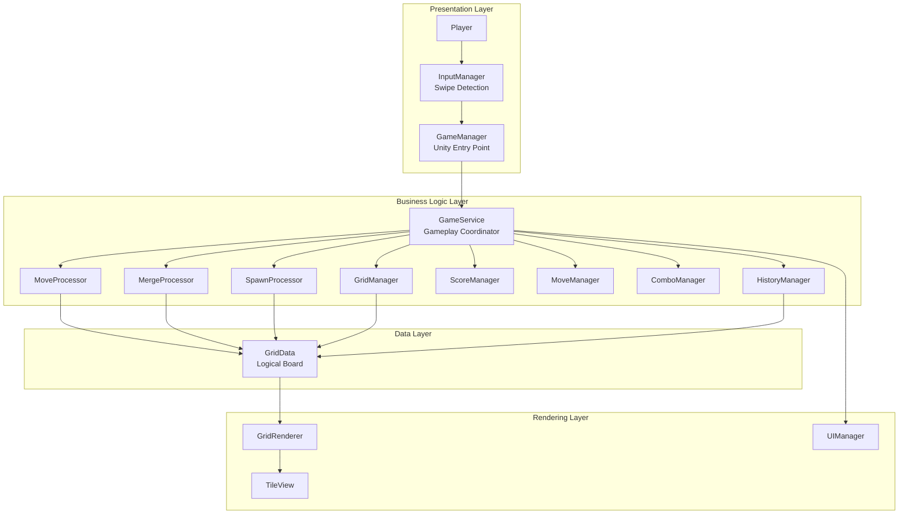

# Grid Puzzle
Project Engineering & Architecture Assignment: Grid Puzzle Challenge

# Grid Puzzle Challenge

A grid-based mobile puzzle game developed in Unity using C# with a strong emphasis on clean architecture, separation of concerns, and optimized game logic.

The project demonstrates scalable software engineering practices by separating gameplay logic from rendering, implementing deterministic state management, and following SOLID design principles. The game is inspired by classic 2048 mechanics and introduces a Combo Multiplier System to enhance gameplay.

# Project Overview

The objective of this project is to build a deterministic grid puzzle game where players slide numbered tiles across a 4×4 board. Tiles with the same value merge to form larger values, increasing the player's score. The project has been designed with a modular architecture to ensure maintainability, scalability, and efficient execution.

Unlike a prototype, the architecture separates game logic from Unity-specific systems, allowing the backend to remain independent of rendering.

# Features
Core Gameplay

.4×4 Grid-Based Puzzle
.Swipe Detection (Up, Down, Left, Right)
.Tile Movement
.Tile Merge Logic
.Random Tile Spawning
.Score System
.Remaining Moves Counter
.Win Detection
.Game Over Detection
.Restart Game
.Undo Last Move

# Extra Gameplay Hook

Combo Multiplier System

To improve player engagement, the game introduces a Combo System.

.Consecutive moves that result in successful merges increase the combo multiplier.
.Each merge awards additional score based on the current combo.
.A move without any merge resets the combo.

This encourages strategic planning rather than random swiping.

# Engineering Features

Pure C# Backend
Grid independent from rendering
Deterministic Undo System
Efficient movement algorithms
Memory-safe history management
Modular Processors
Layered Architecture
SOLID Principles
Optimized update pipeline

# System Architecture

                   ## System Architecture Map



# Functional Code Flow

                               ## Functional Code Flow

```mermaid
flowchart TD

A[User Gesture<br/>Swipe] --> B[InputManager<br/>Detect & Validate Swipe]
B --> C[GameManager<br/>Receive Swipe Event]
C --> D[GameService.ExecuteMove()]

D --> E[HistoryManager<br/>Save Current State]
E --> F[MoveProcessor<br/>Compress Tiles]
F --> G[MergeProcessor<br/>Merge Equal Tiles]
G --> H[ScoreManager<br/>Update Score]
H --> I[ComboManager<br/>Update Combo]
I --> J[MoveProcessor<br/>Final Compression]
J --> K[SpawnProcessor<br/>Spawn New Tile]
K --> L[MoveManager<br/>Consume Move]
L --> M{Win / Game Over?}

M -->|No| N[GridRenderer<br/>Update Tile Views]
M -->|Yes| N

N --> O[UIManager<br/>Refresh Score, Moves,<br/>Combo & Game State]
```

# Gameplay Rules

Swipe to move all tiles.
Tiles slide until blocked.
Equal-value tiles merge.
Every successful move spawns one new tile.
Consecutive merge turns increase the combo multiplier.
Moves are limited to 100.
Reach the target tile (e.g., 2048) or achieve the highest score before running out of moves.

# Performance & Optimization

The project was designed with performance, scalability, and maintainability as primary objectives. The following optimizations have been incorporated into the implementation.

1. Efficient Grid Processing

   .The game logic operates on a lightweight 2D integer array (GridData) instead of manipulating Unity GameObjects.

   .All movement and merge operations are performed on the logical board first, minimizing rendering overhead.

   .Grid traversal uses simple iterative loops with O(N × M) complexity for each move, where N and M are the grid dimensions.

2. Separation of Logic and Rendering

   .Gameplay logic is completely independent of Unity's rendering system.
   .Rendering components (GridRenderer and TileView) only visualize the latest board state.
   .This separation reduces coupling and simplifies maintenance and testing.

3. Memory-Efficient Undo System

   .The Undo system stores lightweight board snapshots (GameSnapshot) rather than entire scene or GameObject hierarchies.

   .Each snapshot contains only:
    .Grid state
    .Current score
    .Remaining moves
    .Combo state

# Future Improvements

The current implementation provides a strong architectural foundation and can be extended with additional gameplay features and production-level enhancements.

Gameplay Enhancements
.Multiple board sizes (5×5, 6×6, custom dimensions)
.Additional power-ups (Bomb, Shuffle, Freeze, Double Score)
.Special obstacle tiles
.Daily challenges and objectives
.Achievement system
.Time Attack and Endless game modes
.Difficulty levels